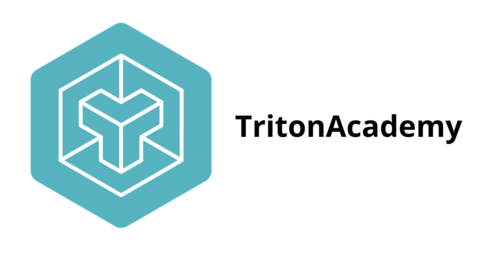

# Triton Academy

<div align="center">

</div>


Triton Academy is an initiative to educate developers on writing efficient GPU kernels using Triton. It's a work in progress and it's goal is to provide:

🎓 Tutorials – Learn Triton step by step  
🔍 Famous Triton Kernels detailed explanations  
📐 Mathematic formulas and proofs behind backpropogation in kernels  
📖 Documentation & Debugging – Official docs and best practices  
🔬 Benchmarks – Performance comparisons with CUDA  

## What is Triton?

Triton is an open-source programming language and compiler designed specifically for GPU programming. It aims to simplify the development of efficient GPU kernels by providing a higher-level abstraction than CUDA or other low-level GPU programming models.

Triton enables developers to write high-performance GPU code with Python-like syntax while automatically handling many low-level optimizations that would otherwise require significant expertise in GPU architecture. It was developed by OpenAI and is now widely used in machine learning and scientific computing applications.

## Why Triton instead of CUDA?

While CUDA offers fine-grained control over GPU programming, it comes with several challenges:

1. **Steep Learning Curve**: CUDA requires understanding complex GPU architecture details
2. **Verbose Code**: Simple operations often require extensive boilerplate code
3. **Manual Optimization**: Developers must manually handle memory coalescing, tiling, and other optimizations
4. **Limited Portability**: CUDA is specific to NVIDIA GPUs

Triton addresses these issues by:

1. **Higher Abstraction**: Provides intuitive programming constructs
2. **Automatic Optimization**: Handles many low-level optimizations automatically
3. **Python Integration**: Seamlessly integrates with the Python ecosystem
4. **Performance**: Achieves performance comparable to hand-optimized CUDA in many cases
5. **Readability**: More maintainable code that clearly expresses intent

## Quick Example: Vector Addition in Triton

Let’s expand on your example and provide comprehensive resources on Triton, details on Triton Academy, and how you can contribute!

```python
import torch
import triton
import triton.language as tl

@triton.jit
def vector_add_kernel(X, Y, Z, N: tl.constexpr):
    pid = tl.program_id(axis=0)  # Get the program ID
    block_size = 128  # Number of elements per block
    offsets = pid * block_size + tl.arange(0, block_size)  # Compute memory offsets
    mask = offsets < N  # Ensure we don’t go out of bounds
    x = tl.load(X + offsets, mask=mask)  # Load X
    y = tl.load(Y + offsets, mask=mask)  # Load Y
    tl.store(Z + offsets, x + y, mask=mask)  # Store the result

# Example usage
N = 1024
X = torch.randn(N, device="cuda")
Y = torch.randn(N, device="cuda")
Z = torch.empty(N, device="cuda")

grid = (N // 128,)
vector_add_kernel[grid](X, Y, Z, N=N)
print(Z)  # Output: X + Y
```

Explanation:
	•	tl.program_id(axis=0) → Gets the program index  
	•	tl.arange(0, block_size) → Generates thread-local indices  
	•	tl.load and tl.store → Handle memory operations efficiently  

## Resources


